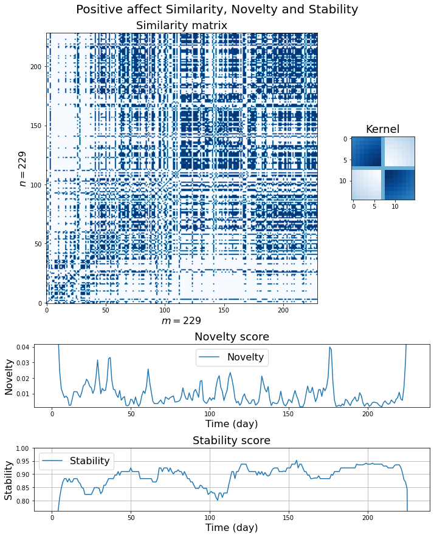
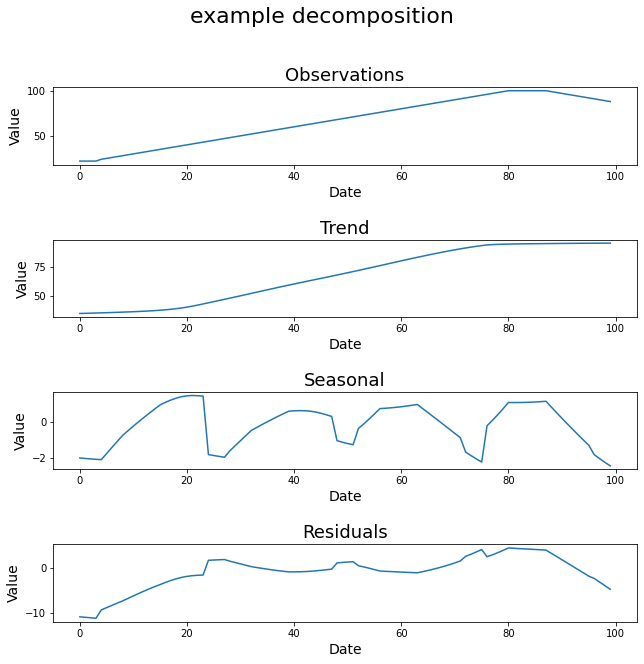
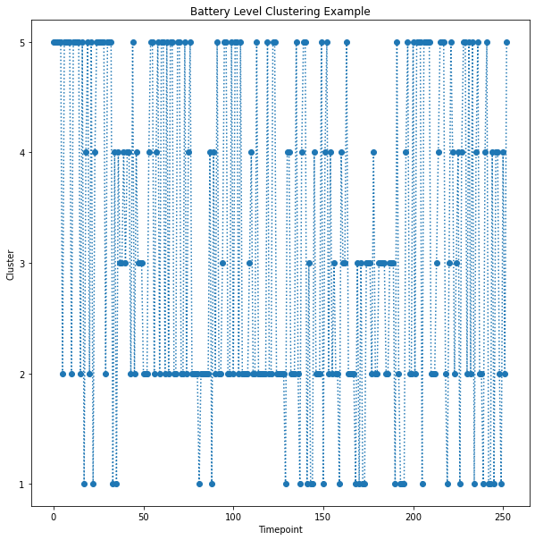
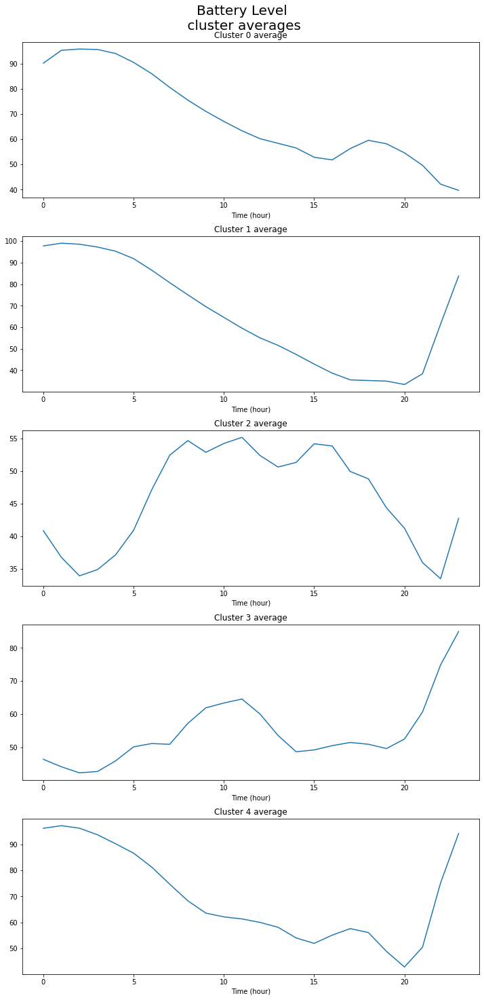
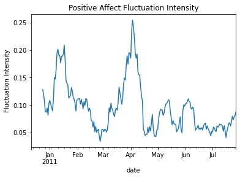
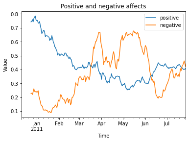
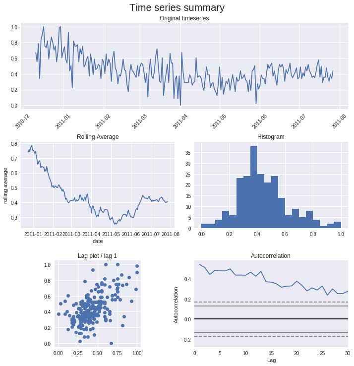

HowTo
=====

This section describes how to run each analysis function independently.

Calculate similarity
--------------------

The example code::
	
	"""
	Created on Sat Apr  3 23:48:38 2021

	@author: arsi
	"""

	import pandas as pd

	from tscfat.Analysis.calculate_similarity import calculate_similarity
		
	# load a dataframe and convert the index to datetime
	df = pd.read_csv('/home/arsi/Documents/tscfat/Data/one_subject_data.csv',index_col=0)
	df.index = pd.to_datetime(df.index)

	# convert one column to a numpy array
	name = 'positive'
	ser = df[name].values.reshape(-1,1)

	sim = calculate_similarity(ser)

The similarity matrix::

	print(sim)
	[[1.         0.8962963  0.8962963  ... 0.78317152 0.75467775 0.81208054]
	 [0.8962963  1.         0.81208054 ... 0.86120996 0.82687927 0.8962963 ]
	 [0.8962963  0.81208054 1.         ... 0.71810089 0.69407266 0.74233129]
	 ...
	 [0.78317152 0.86120996 0.71810089 ... 1.         0.95400788 0.95652174]
	 [0.75467775 0.82687927 0.69407266 ... 0.95400788 1.         0.91435768]
	 [0.81208054 0.8962963  0.74233129 ... 0.95652174 0.91435768 1.        ]]

Calculate Novelty
-----------------

The example code::

	"""
	Created on Sat Apr  3 23:48:38 2021

	@author: arsi
	"""

	import pandas as pd

	from tscfat.Analysis.calculate_similarity import calculate_similarity
	from tscfat.Analysis.calculate_novelty import compute_novelty
		
	# load a dataframe and convert the index to datetime
	df = pd.read_csv('/home/arsi/Documents/tscfat/Data/one_subject_data.csv',index_col=0)
	df.index = pd.to_datetime(df.index)

	# convert one column to a numpy array
	name = 'positive'
	ser = df[name].values.reshape(-1,1)

	# similarity matrix
	sim = calculate_similarity(ser)

	# novelty score and kernel
	nov, kernel = compute_novelty(sim,edge=7)

The novelty score::

	print(nov)
	[0.20766337 0.14769835 0.10181832 0.06656327 0.04818483 0.02417862
	 0.01317275 0.01011372 0.00741401 0.00831496 0.00726132 ...
	 ... 0.01400025 0.03109473 0.06095036 0.10315707 0.16478283 0.23854444]
	 
Calculate Stability
-------------------

The example code::

	"""
	Created on Sat Apr  3 23:48:38 2021

	@author: arsi
	"""

	import pandas as pd

	from tscfat.Analysis.calculate_similarity import calculate_similarity
	from tscfat.Analysis.calculate_stability import compute_stability
		
	# load a dataframe and convert the index to datetime
	df = pd.read_csv('/home/arsi/Documents/tscfat/Data/one_subject_data.csv',index_col=0)
	df.index = pd.to_datetime(df.index)

	# convert one column to a numpy array
	name = 'positive'
	ser = df[name].values.reshape(-1,1)

	# similarity matrix
	sim = calculate_similarity(ser)
	
	# stability score    
	stab = compute_stability(sim)

The stability score::
	
	print(stab)
	[0.         0.         0.         0.66850829 0.76100629 0.81208054
	 0.84615385 0.8705036  0.88321168 0.88321168 0.8705036   ...
	 ...        0.93316195 0.93556701 0.93556701 0.93556701 0.92602041
	 0.90636704 0.87893462 0.8705036  0.84320557 0.         0.
	 0.        ]

Plot Similarity
---------------

The example code::

	"""
	Created on Sat Apr  3 23:48:38 2021

	@author: arsi
	"""

	import pandas as pd

	from tscfat.Analysis.calculate_similarity import calculate_similarity
	from tscfat.Analysis.calculate_novelty import compute_novelty
	from tscfat.Analysis.calculate_stability import compute_stability
	from tscfat.Analysis.plot_similarity import plot_similarity

	# load a dataframe and convert the index to datetime
	df = pd.read_csv('/home/arsi/Documents/tscfat/Data/one_subject_data.csv',index_col=0)
	df.index = pd.to_datetime(df.index)

	# convert one column to a numpy array
	name = 'positive'
	ser = df[name].values.reshape(-1,1)
	# kernel edge length -> window = 2*edge + 1
	edge = 7

	# similarity, stability and novelty
	sim = calculate_similarity(ser)
	stab = compute_stability(sim)
	nov, kernel = compute_novelty(sim, edge = edge)

	_ = plot_similarity(sim,
		            nov,
		            stab,
		            title = "Positive affect Similarity, Novelty and Stability",
		            doi = None,
		            savepath = False, 
		            savename = False,
		            ylim = (0,0.05),
		            threshold = 0.9,
		            axis = None,
		            kernel = kernel,
		            test = False
		            )

The output image:  

  
Timeseries Decomposition
------------------------

STL_decomposition function decomposes the given timeseries into **trend**, **seasonal**, and **residual** components.

The example code::

	"""
	Created on Thu Apr  1 14:41:53 2021
	
	@author: arsii
	"""

	import pandas as pd

	from tscfat.Analysis.decompose_timeseries import STL_decomposition
		
	# load a dataframe and convert the index to datetime
	df = pd.read_csv('/home/arsii/tscfat/Data/Test_data.csv',index_col=0)
	df.index = pd.to_datetime(df.index)
		
	# timeseries has to be a numpy array
	series = df.level.values
		
	_ = STL_decomposition(series,
	              		title = 'example decomposition',
	              		test = False,
	              		savepath = False,
	              		savename = False,
	              		ylabel = "Value",
	              		xlabel  = "Date",
	              		dates = False,
	              		)  
 
The output image:  

  
     
Timeseries Clustering
---------------------

The example code::

	"""
	Created on Tue Apr  6 14:01:11 2021

	@author: arsii
	"""

	import pandas as pd
	import numpy as np

	from tscfat.Analysis.cluster_timeseries import cluster_timeseries

	# Load the data and convert index into Datetime
	df = pd.read_csv('/home/arsi/Documents/tscfat/Data/Battery_test_data.csv',index_col=0)
	df.index = pd.to_datetime(df.index)

	df = df.resample('H').mean()

	df = df.interpolate()

	df = df.resample('D').apply(list)

	df = df[1:-1]

	data = np.stack(df.battery_level.values)

	clusters = cluster_timeseries(data,
		                      FIGNAME = False,
		                      FIGPATH = False,
		                      title = 'Battery Level', 
		                      n = 5, 
		                      mi = 5, 
		                      mib = 5, 
		                      rs = 0, 
		                      metric = 'dtw', 
		                      highlight = None,
		                      ylim_ = (0,100)
		                      )

The output images:  

  

    	
Degree of Distribution
----------------------
		
The example code::

	"""
	Created on Mon Apr  5 21:18:34 2021

	@author: arsi
	"""
	  
	import pandas as pd
	   
	from tscfat.Analysis.degree_of_distribution import distribution_degree

	# load a dataframe and convert the index to datetime
	df = pd.read_csv('/home/arsi/Documents/tscfat/Data/one_subject_data.csv',index_col=0)
	df.index = pd.to_datetime(df.index)
	   
	# set range of fluctuation
	scale = 1
	   
	# window
	w = 14
	   
	# calculate distribution degree
	dist_deg = df.positive.rolling(window = w).apply(lambda x: distribution_degree(x.values,scale,w))
	   
	# plot the result
	ax = dist_deg.plot()
	ax.set(ylabel='Distribution Degree', title="Positive Affect Distribution Degree")
	
The output image:

.. image:: ../images/distribution_degree.png
  :width: 800
  :alt: Alternative text

Fluctuation Intensity
---------------------
	
The example code::

	"""
	Created on Sat Apr  3 23:48:38 2021

	@author: arsi
	"""

	import pandas as pd

	from tscfat.Analysis.fluctuation_intensity import fluctuation_intensity

	# load a dataframe and convert the index to datetime
	df = pd.read_csv('/home/arsi/Documents/tscfat/Data/one_subject_data.csv',index_col=0)
	df.index = pd.to_datetime(df.index)

	# set range of fluctuation
	scale = 1

	# window
	w = 14

	# calculate fluctuation intensity
	flu_int = df.positive.rolling(window = w).apply(lambda x: fluctuation_intensity(x.values,scale,w))

	# plot the result
	ax = flu_int.plot()
	ax.set(ylabel='Fluctuation Intensity', title="Positive Affect Fluctuation Intensity")	

The output image:

  

Plot Timeseries
---------------

The example code::

	"""
	Created on Fri Apr  2 12:14:27 2021

	@author: arsi
	"""

	import pandas as pd

	from tscfat.Analysis.plot_timeseries import plot_timeseries
		
	# load a dataframe and convert the index to datetime
	df = pd.read_csv('/home/arsi/Documents/tscfat/Data/one_subject_data.csv',index_col=0)
	df.index = pd.to_datetime(df.index)
		
	# A list containing column names
	cols = ['positive','negative']

	# Rolling window size
	window = 14

	_ = plot_timeseries(df,
		            cols,
		            title = 'Positive and negative affects',
		            roll = window, 
		            xlab = "Time", 
		            ylab = "Value", 
		            ylim = False, 
		            savename = False,
		            savepath = False, 
		            highlight = False, 
		            test = False
		            )

The output image:

Rolling Statistics
------------------

The example code::

	import pandas as pd

	from tscfat.Analysis.rolling_statistics import rolling_statistics
	
	# load a dataframe and convert the index to datetime
	df = pd.read_csv('/home/arsii/tscfat/Data/one_subject_data.csv',index_col=0)
	df.index = pd.to_datetime(df.index)
	
	# dataframe can contain only one column
	df = df.filter(['positive'])
	
	# rolling window length
	window = 14

	_ = rolling_statistics(df,
		               window,
		               doi = None,
		               savename = False,
		               savepath = False,
		               test = False,
		               )

The output image:

.. image:: ../images/rolling.png
  :width: 800
  :alt: Alternative text
  
Summary Statistics
------------------

The example code::

	"""
	Created on Mon Apr  5 21:40:44 2021

	@author: arsi
	"""

	import pandas as pd
		
	from tscfat.Analysis.summary_statistics import summary_statistics
		
	# load a dataframe and convert the index to datetime
	df = pd.read_csv('/home/arsi/Documents/tscfat/Data/one_subject_data.csv',index_col=0)
	df.index = pd.to_datetime(df.index)

	# Select 'Positive' column and convert it into pandas series
	ser = df['positive']

	# Rolling window size
	w = 14
	 
	_ = summary_statistics(ser,
		               title = "Time series summary",
		               window = w,
		               savepath = False,
		               savename = False,
		               test = False,
		               )
	
The output image:

